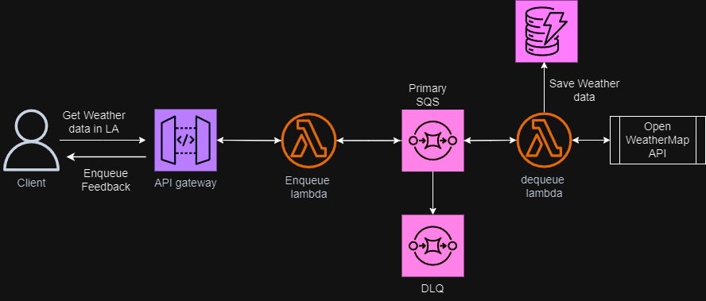

# Processing Heavy Payloads Asynchronously

We used serverless framework to create backend resources

## What are the resources used in this architecture?

API Gateway

Lambda

SQS (Primary Queue and DLQ created Manually.)

DynamoDB

The Diagram below shows the architecture.

